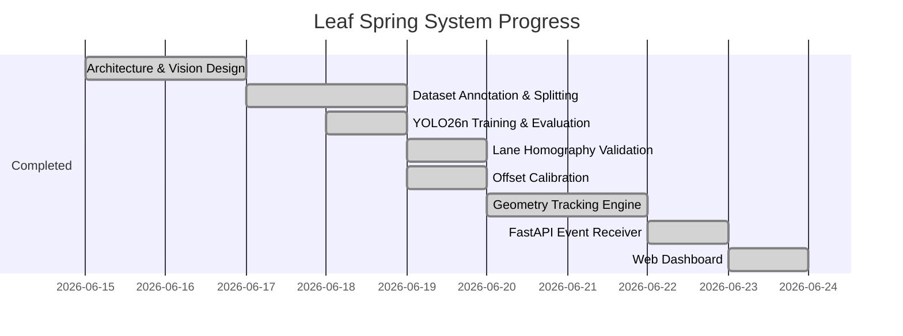

# Leaf Spring Assembly Verification System - Project Context

## 1. Project Goal & Overview
The objective is to build an automated vision system to verify correct leaf spring installation on a moving vehicle assembly line. The system utilizes:
* **Two Side Cameras**: Detect spring model picked and its source side.
* **One Top Camera**: Identifies vehicle chassis geometry, rod locations, spring locations, and final slot occupancy.

### Verification Rule (Left-to-Right Matching)
The system must ensure that for each front or back pair, the left and right components match.
* **Front Pair Match**: Front-Left (FL) must match Front-Right (FR).
* **Rear Pair Match**: Rear-Left (RL) must match Rear-Right (RR).
* Left and right sides are tracked and validated independently. A mismatch instantly triggers a `FAIL` status.

---

## 2. System Architecture & Tracking Pipeline

### Ingestion & Stream Processing
1. **Side-Camera Inputs**: Pickup events (e.g., model `GREEN_TRIANGLE` picked on `LEFT`) are sent in real-time via a REST API hosted on a **FastAPI** server. Events are stored in side-specific FIFO queues (`LEFT` queue, `RIGHT` queue).
2. **Top-Camera Inputs**: Real-time video frame feed is processed to locate chassis features and verify installation. The video source is configured via the `VIDEO_SOURCE` environment variable (supporting RTSP stream URLs as well as local MP4 demo files like `mydata/videos/chassis1.mp4`, `chassis2.mp4`, or `chassis3.mp4`).

```
Side Cameras          Top Camera
    ↓                     ↓
Pickup Event         Warped Feed (Perspective Normalized)
    ↓                     ↓
FastAPI REST API     YOLO26n Detection (rod, spring)
    ↓                     ↓
FIFO Queue           Unified Reference Point Tracker
    ↓                     ↓
    └──────────┬──────────┘
               ↓
      Slot Occupancy & Assignment
               ↓
      Left-to-Right Match Verification (FL == FR, RL == RR)
               ↓
      Pass (Green) / Fail (Red) Result
```

### Lane Normalization (Perspective Warp)
Due to diagonal camera angles and variable vehicle positions, raw frames are perspective-rectified before object detection.
* Lane boundaries are derived from `left_edge` and `right_edge` keypoint annotations in Label Studio.
* A perspective transform is computed and saved as `mydata/metadata/homography.npy` and `mydata/metadata/warp_config.json` to project frames into a stabilized coordinate system.

### Unified Reference Point Tracker
Rods are used as stable spatial reference points on the chassis. However, once a rear spring is installed, it sits directly on top of the torque rod, occluding it.
* **Rod Visible**: The system tracks the detected `left_rod` and `right_rod` as reference coordinates for the rear slots (RL and RR).
* **Rod Occluded**: When a rear spring is installed, the tracking anchor dynamically switches to the center of the detected `RL_spring` or `RR_spring`.
* **Front Projection**: Front slots (FL and FR) are projected forward at a calibrated offset vector $(dx, dy)$ from the active rear reference point.
* **Calibrated Offsets (pixels)**:
  * **Left Side (FL - RL)**: $dx_{mean} = +6.7325$ (std: 7.0538), $dy_{mean} = -216.4267$ (std: 9.6160)
  * **Right Side (FR - RR)**: $dx_{mean} = -4.2520$ (std: 6.8086), $dy_{mean} = -206.6953$ (std: 16.5375)

### Slot Occupancy & Model Assignment
* Slots (FL, FR, RL, RR) are monitored using spatial region-of-interest boxes relative to the reference points.
* When a slot transitions from *empty* to *occupied* (when a `spring` bounding box overlaps the slot):
  * The system pops the first event from the corresponding side's queue via the server REST API and assigns that model (e.g. `RED_A`) to the slot.
  * If the queue is empty during an occupancy transition, the slot is assigned `UNKNOWN`, triggering a match error.

### Queue Data Flow & Source of Truth
* The **server SQLite database** is the single source of truth for side-camera pickup queues.
* The web dashboard renders queue state exclusively from server-broadcast WebSocket messages (`{type: "queue"}`).
* The vision tracker process pops queue items via the server REST API (`POST /api/queue/pop`) during slot occupancy transitions. The tracker maintains a local queue copy for fallback if the server is unreachable, but the local copy is never broadcast to the frontend.

### Tracker Reset Behavior
* **Explicit user reset** (via dashboard button or `POST /api/tracker/reset`): Clears server queues, resets tracker state, and rewinds video if source is an MP4 file.
* **Video file loop** (EOF reached on MP4): Resets tracker state only. Queues are preserved so user-queued pickup events are not lost.
* **Lost-frames timeout** (vehicle leaves frame): Resets tracker state only. Queues are preserved for the next vehicle.
* **RTSP streams**: Video seek/rewind is not supported by OpenCV on live RTSP feeds. Reset only clears queues and resets tracker state; the stream continues from the current live frame.

### Async Pipeline Design
* The vision pipeline (`run_tracker.py`) runs as an async event loop using `asyncio` and `websockets`.
* Tracker state updates and HTTP calls to the server API (queue pops/syncs) run synchronously within the event loop. The tracker object is not thread-safe, so all mutations happen sequentially in the main coroutine.
* RTSP reconnection logic releases the previous `VideoCapture` handle before creating a new one to prevent socket/handle leaks.

---

## 3. Dataset & Model Performance

### Dataset Statistics
The dataset contains a total of **459** images (excluding 3 empty-background images: `chassis1_0001`, `chassis1_0002`, `chassis1_0129`).

| Split | Images | Rods (Class 0) | Springs (Class 1) | Total Annotations |
| :--- | :---: | :---: | :---: | :---: |
| **Train** | 365 | 321 | 1067 | 1388 |
| **Val** | 47 | 46 | 132 | 178 |
| **Test** | 47 | 39 | 135 | 174 |
| **Total** | **459** | **406** | **1334** | **1740** |

### YOLO26n Model Status
A YOLO26n (End-to-End NMS-Free Nano) model was trained for 100 epochs using the SGD optimizer at native resolution `imgsz=[576, 1088]` on an RTX 4050.
* **Layers**: 122 (fused)
* **Parameters**: 2,375,226
* **GFLOPs**: 5.2

#### Validation Split Performance
* **Overall**: Precision = 0.960, Recall = 0.969, mAP50 = 0.977, mAP50-95 = 0.752
* **Rod**: Precision = 0.956, Recall = 0.952, mAP50 = 0.966, mAP50-95 = 0.680
* **Spring**: Precision = 0.963, Recall = 0.985, mAP50 = 0.988, mAP50-95 = 0.825

#### Test Split Performance (Unseen)
* **Overall**: mAP50 = 0.9738, mAP50-95 = 0.8138
* **Rod**: Precision = 0.8899, Recall = 0.8974, mAP50 = 0.9530, mAP50-95 = 0.7625
* **Spring**: Precision = 0.9497, Recall = 0.9926, mAP50 = 0.9945, mAP50-95 = 0.8652
* **Average Speed**: Inference = 15.5 ms/image (preprocess: 3.6 ms, postprocess: 0.7 ms).

---

## 4. Project Directory Structure
```
project_root/
├── context/
│   ├── context.md                  # This unified reference file
│   └── usage_instructions.md       # Usage & RTSP integration guide
├── handoffs/                       # Conversation handoff logs
├── plans/                          # Design and execution plans
├── mydata/
│   ├── raw/                        # Original video streams and raw frames
│   ├── videos/                     # Source MP4 video files for demo/testing
│   ├── metadata/                   # project_export.json, homography.npy, warp_config.json
│   ├── processed/                  # Warped image frames used for inference
│   ├── calibration_samples/        # Sample images with 4 springs placed for offset calibration
│   └── system.db                   # SQLite database (queues, vehicle run history)
├── src/
│   ├── server.py                   # FastAPI web backend, REST API, WebSocket hub
│   ├── database.py                 # SQLite data access layer (queues, vehicle runs)
│   ├── tracker.py                  # GeometryTracker state machine (ref points, slots, matching)
│   ├── run_tracker.py              # Async vision pipeline runner (RTSP/MP4 → YOLO → tracker → WS)
│   ├── run_tracker_sim.py          # Offline simulation runner (no server, local queues)
│   ├── calibrate_offsets.py        # Front-rear spring offset calibration tool
│   ├── train.py                    # Model training script
│   ├── val_test.py                 # Validation and test split evaluation script
│   ├── inference.py                # Raw inference test script
│   ├── warp_test.py                # Homography and lane bounds estimation
│   ├── preview_warp.py             # Single-frame perspective warp preview
│   ├── warp_all.py                 # Multi-processed batch warping utility
│   └── static/
│       └── index.html              # Web dashboard (glassmorphism dark UI)
├── tests/
│   ├── test_database.py            # SQLite queue and vehicle run tests
│   ├── test_server.py              # FastAPI REST + WebSocket integration tests
│   ├── test_tracker_api.py         # Tracker ↔ API interaction tests
│   └── test_run_tracker.py         # Async pipeline mocked integration test
├── runs/                           # YOLO training output runs
└── yolo26n.pt                      # Pre-trained YOLO26n base weights
```

---

## 5. Development Phases



### Remaining Tasks
All development tasks have been successfully completed and validated.
* **Architecture & Vision Design**: Complete
* **Dataset Annotation & Splitting**: Complete
* **YOLO26n Training & Evaluation**: Complete
* **Lane Homography & Offset Calibration**: Complete
* **Geometry Tracking Engine**: Complete
* **FastAPI Event Receiver & SQLite Integration**: Complete
* **Web Dashboard**: Complete
